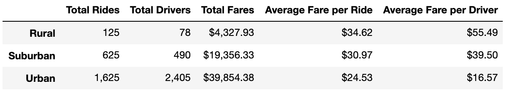

# PyBer_Analysis

## Overview
PyBer, a ridesharing company, has assigned us with conducting an analysis of the relationships between the type of city, and the number of drivers, rides and average fares. To best illustrate these relationships, we have provided visualizations in order for PyBer to better understand and utilize this data to improve the access to their services in underserved communities. 

Resources
- Data Sources: city_data.csv and ride_data.csv
- Software: Python 3.7.6, Jupyter Notebook
- Dependencies: pandas and matplotlib

## Results
In the dataframe below, we organized the city and ride data by the three city types, rural, suburban, urban. 

    
   - As expected, urban cities yielded the most total rides, total drivers, and total fares.
   - The average fare per ride was the highest in rural areas at $34.62, $4 more than suburban areas and $10 more than urban areas.
   - The average fare per driver was the highest in rural areas at $55.49, $16 higher than suburban cities and $39 higher than urban cities. 

Based on the total fares per city type, we then created a multi-line graph with the three city types from January 1st 2019 to April 29th 2019 charted for each week.

   
   - Urban cities consistently produced highest total fares per week followed by suburban areas, and rural areas producing the lowest.

## Summary
From our results, we are making three proposals to try to address the disparities between urban, suburban, and rural areas.

### Driver Density and Recruitment
   Our data showed that PyBer had 2,405 drivers take 1,625 trips in urban areas. The supply of drivers should exceed the demand for rides in order to maximize usage and availability for our riders. However, this is not the case in rural or suburban areas where the total rides exceed the number of drivers. Thus, we suggest running an initiative to recruit more drivers for those areas in order to not lose potential users advertising the high average fares per ride and average fares per driver.
        
### Investment in Marketing
   Rural and suburban areas require further analyze to hone in on the demand for our services, given the higher number of car owners. One way to gain further data and insight into this is to invest in marketing of our services in those areas. Since, locally operated, radio dispatched taxi and limousine services are more prominent in those areas, we need to see if our lack of presence in drivers and brand awareness are the issue or a larger lack of demand.

### Flat Rate Options and Further Analysis
   We should consider flat rate options for rural areas, as we may be pricing out some of our potential consumers because of the lack of perceived convenience given the high average fares and the number of car owners. In order to better determine potential tiering of the rates, we could collect data on the most traveled to destinations from these riders and calculate rates based on this for those destinations.
